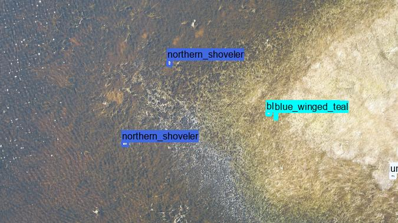
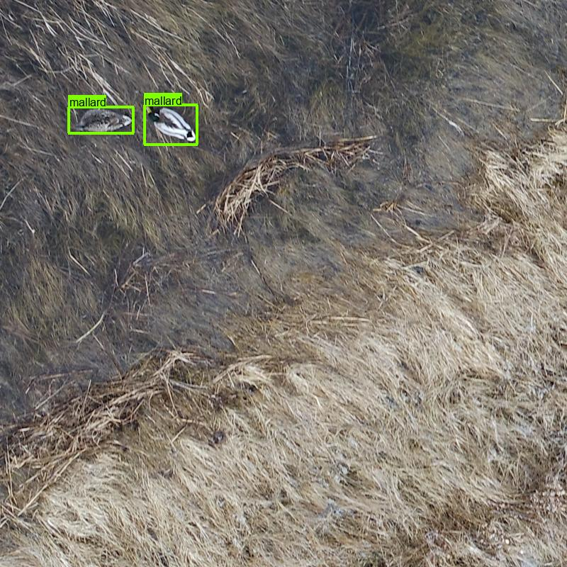

## UND duck detector training

### Overview

The code in this repo trains and evaluates models to detect ducks and other waterfowl in aerial images, based on a dataset provided by the [Felege Wildlife Lab](https://arts-sciences.und.edu/academics/biology/susan-felege/).

There are around 35,000 images total, about 95% of which contain no birds.  Images are around 5000x3000.  A typical ground truth image looks like this:

 

The annotations you can vaguely see as different colors correspond to different species of bird.  Most of this repo operates on 1280x1280 patches that look like this (this is also a ground truth patch, not a model prediction):

 

### Files

These are listed in roughly the order in which you would use them.

#### und-ducks-data-import.py

* Match images to annotation files
* Read the original annotations in Pascal VOX format
* Convert to COCO format
* Do a bunch of miscellaneous consistency checking

#### und-ducks-training-data-prep.py

* For all the images with at least one annotation, slice into mostly-non-overlapping patches
* Optionally sample hard negatives (I did not end up actually using any hard negatives)
* Split into train/val
* Export to YOLO annotation format

#### und-ducks-training.py

* Train the model (training happens at the YOLOv5 CLI, but this script documents the commands)
* Run the YOLOv5 validation scripts
* Convert YOLOv5 val results to MD .json format
* Example code to use the MD visualization pipeline to visualize results
* Example code to use the MD inference pipeline to run the trained model

#### und-ducks-inference.py

* Run inference on a folder of images, which means, for each image:

    * Split the image into overlapping patches
    * Run inference on each patch
    * Resolve redundant detections
    * Convert YOLOv5 output to .json (in MegaDetector format)

#### und-ducks-postprocessing.py

* Do stuff with inference results:

    * Generate patch-level previews from image-level model results
    * Generate estimated image-level bird counts from image-level model results
